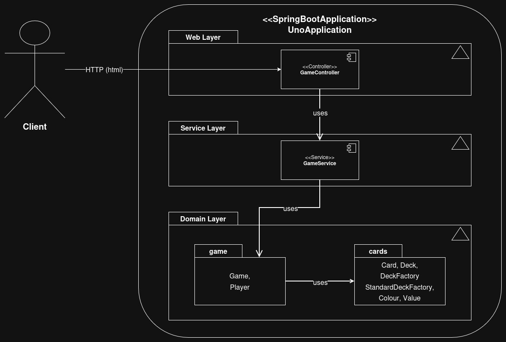

# Uno - Pro Gamers

---

## Links

- **Team Charter & Processes:**
- **Trello Board:**
- **Team Slack Channel:**

---

## Table of Contents

1. [Project Title & One-liner](#1-project-title--one-liner)
2. [Project Overview](#2-project-overview)
3. [Tech Stack & Features](#3-tech-stack--features)
4. [Getting Started (How to Run)](#4-getting-started-how-to-run)
5. [Architecture Overview](#5-architecture-overview)

---

## 1. Project Title & One-liner

---

## 2. Project Overview

---

## 3. Tech Stack & Features

---

## 4. Getting Started (How to Run)

---

## 5. Architecture Overview

---

### 5.1 High-level Layer Diagram

From a high-level, there are two primary actors:
- **Client:**
  - Represents the end user's browser
  - Sends HTTP requests and receives rendered HTML pages
- **UnoApplication:**
  - The main entry-point for the Spring Boot application.
  - Starts the embedded server, scans for components, wires up controllers, services, and domain beans.

---

### Web Layer

**Component:** `<<Controller>> GameController`

**Responsibilities:**

- Handle incoming HTTP requests from the browser (e.g. `/game`, `/game/start`, etc)
- Call `GameService` to execute game actions (start game, draw card, etc)
- Populate a Spring `Model` with game state (players, hands, deck, etc)
- Return a view name (e.g. `"game"`) to allow Thymeleaf to render the correct template

**Client -> Web Layer:**

- The above diagram shows the Client sending `HTTP` requests to `GameController`
- Responses are `HTML` views rendered via Thymeleaf
- The end user interacts with the game through links and forms on these pages

---

### Service Layer

**Component:** `<<Service>> GameService`

**Responsibilities:**

- Acts as an **orchestrator** around the core `Game` object
- Manages as **single** Uno game instance running in the application
- Provides higher-level, encapsulated operations used by the controller, e.g.:
  - `startNewGame()`
  - `drawForPlayer(index: int, model: Model)`
  - `playCard(index: int, card: Card, model: Model)`

**Web Layer -> Service Layer:**

- The controller **never** directly manipulates game state
- All game-related actions go through the `GameService` to keep controllers thin and domain logic central

---

### Domain Layer

*These classes are **pure Java**: they do not know about HTTP, Spring, or Thymeleaf*

The domain layer is split into **two packages:**

**1. `domain.game` &mdash; game state & rules**

This contains classes that represent UNO table state and player behaviour:

- `Game`
  - Owns the draw pile (`Deck`) and discard pile (`DiscardPile`)
  - Tracks players, current turn, play direction, and applies game rules
- `Player`
  - Represents an individual player's hand and UNO status
- `DiscardPile`
  - Tracks the sequence of cards played
  - Exposes the current top card and allows refilling the deck when the draw pile expires

**2. `domain.cards `&mdash; card and deck model**

This contains lower-level card model classes:

- `Card`
  - Combines a `Colour` and `Value`
- `Deck`
  - Encapsulates a list of `Card` objects and the draw card feature
- `StandardDeckFactory`
  - Builds a standard UNO deck
- `Colour` and `Value`
  - Enumerate all allowed colours and card types

**Service Layer -> Domain Layer:**

- `GameService` talks to the domain layer by calling methods on `Game`, `Player`, and `Deck`
- `Game` in turn uses `DiscardPile`, `Card`, and `Deck` to maintain and update game state

**`domain.game` -> `domain.cards`:**

- `domain.game` depends on `domain.cards`:
  - `Game`, `Player`, and `DiscardPile` all work with `Card` and `Deck`

---